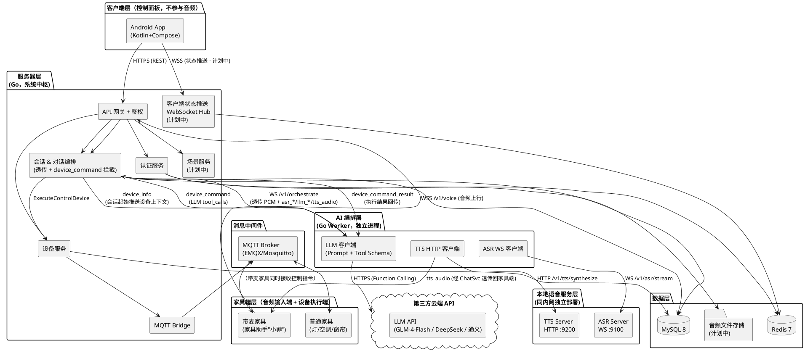
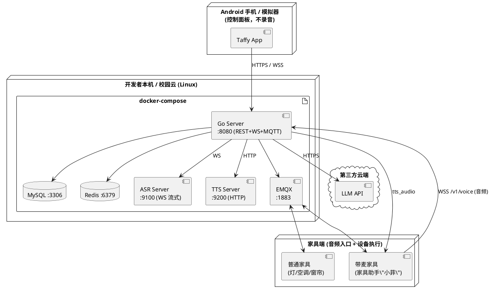
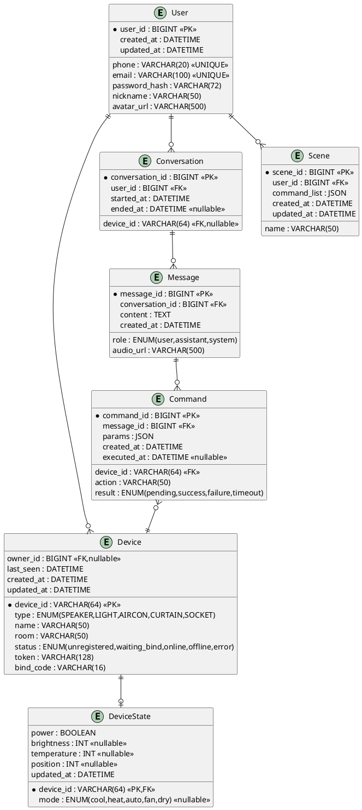
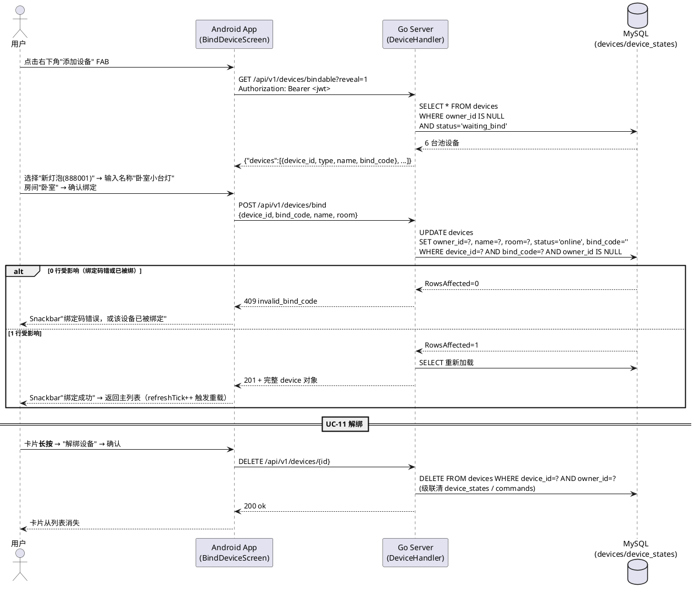
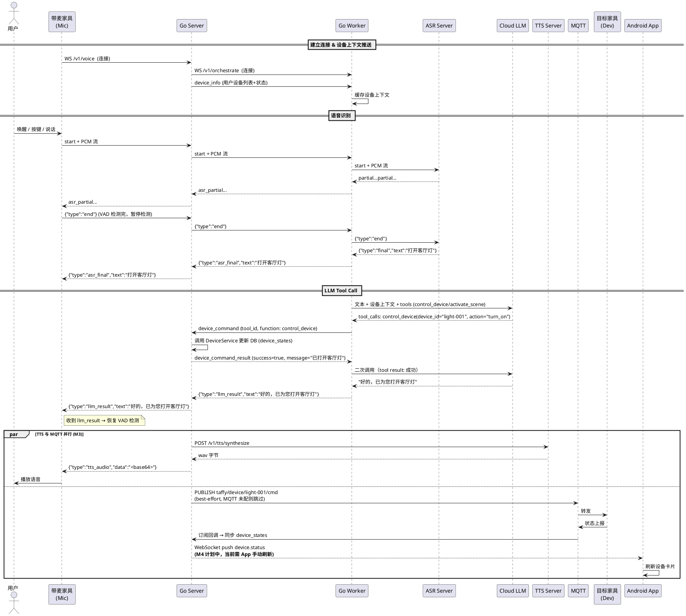
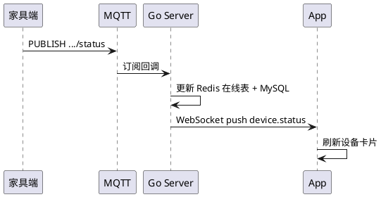

# 《智能家居语音交互助手系统》软件设计文档

| 项目名称 | 智能家居语音交互助手系统 |
|---|---|
| 项目代号 | Taffy（智能家居语音助手 / Smart Home Voice Assistant） |
| 文档版本 | v1.8 |
| 文档状态 | 草案（Draft） |
| 编写人 | 关梓浩（统稿）；林帅 / 马正朗 / 吴承凯 / 刘智冲（分模块） |
| 编写日期 | 2026-05-18 ~ 2026-05-29 |
| 审核人 | 全体成员 |

---

## 修订历史

| 版本 | 日期 | 修订人 | 修订内容 |
|---|---|---|---|
| v1.0 | 2026-05-24 | 关梓浩 | 初稿 |
| v1.1 | 2026-05-09 | 关梓浩 | 架构调整：音频输入源由 App 改为家具端；原 M-LM（Python 工作流）合并进 Go Server；新增 Go Server ↔ ASR 的 WebSocket 流式链路；客户端不再承担录音职责 |
| v1.2 | 2026-05-10 | 关梓浩 | 补充 M2 实现细节：LLM 配置方式（config.yaml + LLM_API_KEY）、llm_result/llm_error 协议事件、家具端 VAD pause/resume 机制、Android 客户端框架已落地 |
| v1.3 | 2026-05-16 | 关梓浩 | 数据库设计落地：新增 DeviceState 实体与表结构、7 张表 DDL 迁移脚本已入库、Redis 缓存 Key 设计、JWT 认证实现、REST API 已落地 |
| v1.4 | 2026-05-16 | 关梓浩 | LLM 调用方式重大调整：由 Server 内部 JSON Schema 解析改为 Worker 侧 OpenAI Function Calling（Tool Call）；新增 Worker↔Server 设备控制协议（device_command / device_command_result / device_info）；VoiceHandler 从纯透传升级为 device_command 拦截执行 + 设备上下文推送；更新语音指令全链路流程图 |
| v1.5 | 2026-05-28 | 关梓浩 | 与代码现状对齐：①§2.1 架构图把 ASR/LLM/TTS 客户端从 Server 包内拆到独立的 "AI 编排层（Go Worker）"；②§2.3 模块表标注场景服务 / 客户端推送 Hub 为计划中；③§4.2 REST API 表精确区分 ✅ 已落地与 📅 计划中（仅 auth/devices/health 已落地），统一响应包装更正为"成功直返业务对象 + 失败 `{error,message}`"，取消 v1.0 的 `{code,msg,data}` 三件套表述；④§4.7 错误码由数字 code 改为字符串机器码（`invalid_request_body` / `phone_already_registered` / `invalid_phone_or_password` 等），新增 HTTP 状态码列；⑤§6.1 设备绑定与 §6.3 状态推送时序图明确标"端点计划中"；⑥§6.2 MQTT 分支注明 best-effort 与"App 实时推送 M4 计划中" |
| v1.6 | 2026-05-29 | 关梓浩 | UC-03 设备绑定 + UC-11 解绑落地：①§4.2 REST API 表把 `/devices/bindable`、`/devices/bind`、`/devices/{id}` PUT/DELETE 共 4 条端点从计划中升级为 ✅ 已落地，替换 v1.5 占位的 `/devices/pending` / `/devices/{id}/unbind` 命名；②§4.7 错误码新增 `invalid_bind_code` / `device_id_required` / `bind_code_required` / `name_required` / `device_not_found` / `not_device_owner` 六项；③§5 ER 图与表结构：`devices.owner_id` 改 `BIGINT NULL`（FK 改为 `ON DELETE SET NULL`）、新增 `bind_code VARCHAR(16)`，新增迁移脚本 `003_device_binding.sql`；④§6.1 设备绑定流程图取代旧版"端点计划中"占位，落地为"待绑定池模式"——`waiting_bind` 设备 owner 为空，用户输入 6 位 `bind_code` 触发 `BindToOwner` UPDATE；⑤客户端架构标注：`BindDeviceScreen` + `BindDeviceViewModel` + 卡片长按 `DropdownMenu` 已落地。 |
| v1.7 | 2026-05-29 | 关梓浩 | UC-05 文本对话客户端入口落地：①`pkg/protocol` 新增 `EventTypeTextInput = "text_input"` 共享常量；②Worker `/v1/orchestrate` 的 `handleUpstreamControl` 新增 `text_input` 分支，跳过 ASR 直接调用 `handleLLMWithTools`，并把文本回显为 `asr_final` 帧让客户端渲染逻辑统一；③§4.5 家具端音频 WebSocket 表新增 "Android→Server `text_input`" 行；④客户端新增 `ChatWebSocket` + `TextChatScreen` + `ChatViewModel`，支持双气泡 UI / 思考中提示 / 设备状态自动随聊天回流刷新；⑤UC-02 闭环：DeviceListScreen AppBar 加登出按钮（清 JWT → 跳登录页）。无需改动 server 透传层（client→worker 帧无脑透传）。|
| v1.8 | 2026-05-29 | 关梓浩 | UC-04 增强（设备详情页）+ UC-10 实时状态推送落地：①新增 `server/internal/hub` 包——纯内存 per-user WS Hub，sendBuffer=32 慢客户端丢帧不阻塞业务路径；②新增 `/ws?token=<jwt>` 端点（`handler/realtime.go`），WS Upgrade 前 `JWTMiddleware.ParseToken` 校验；③`voice.go::handleDeviceCommand` 在控制成功后异步广播 `device_state_changed`；`device.go::UpdateDeviceState` 也广播一次（多端同步）；④§4.2 REST 表新增 `/ws` ✅ 已落地行；客户端 README 加目录树新条目；⑤砍掉 UC-08 历史会话——本项目对话本质是命令通道，"聊天历史"无业务价值，写入路径已就绪但**查询 API 决定不做**；⑥客户端新增 `RealtimeWebSocket` + `DeviceDetailScreen` + `DeviceDetailViewModel`，列表卡片**单击进详情**（亮度/温度/模式/开合度滑块），实时推送统一刷新主列表卡片，主标题旁显示"实时"连接 Badge。|

---

## 1. 引言

### 1.1 编写目的

本文档描述"智能家居语音交互助手系统（Taffy）"的总体架构与关键设计决策，包括模块划分、接口约定、数据组织、关键流程等，作为后续编码实现与测试的依据。**本文聚焦"做什么、怎么分、怎么接"，不涉及具体实现代码与目录结构，相关细节由各模块在开发阶段自行决定。**

### 1.2 设计原则

| 原则 | 说明 |
|---|---|
| 分层架构 | 表现层 / 业务逻辑层 / 数据层 清晰分离 |
| 高内聚低耦合 | 按业务领域划分模块，模块间仅通过接口通信 |
| 面向接口编程 | ASR、TTS、LLM、设备协议均以接口或 API 形式暴露，底层实现可替换 |
| 消息驱动 | 设备侧采用 MQTT 发布/订阅，避免强耦合 |
| 面向演示 | 关键链路优先保证稳定与可视化，避免过度设计 |

---

## 2. 总体架构

### 2.1 系统总体架构图



**架构要点（v1.1 ~ v1.5）**：

1. **音频输入端是家具端，不是 App**（v1.1）：用户对着"带麦家具"（家具助手"小菲"）说话，家具端通过 WebSocket 把 PCM 流发给 Go Server。
2. **Go Server 是系统中枢，但不直接承担 AI**（v1.4/v1.5）：Server 只做家具端 / 客户端的接入、JWT / 设备 Token 鉴权、用户 / 设备 CRUD、对话历史落库、MQTT 设备控制；ASR / LLM / TTS 编排已**全部下沉到独立的 Go Worker 进程**（`worker/`，监听 `:8090`）。
3. **客户端 App 不录音**（v1.1）：仅做登录、设备管理、状态查看、场景触发、对话历史，通过 REST + WSS 与 Go Server 通信。M2 已搭建基础框架（Kotlin + Compose + OkHttp WebSocket），M3 已完成登录注册 / 设备列表 / 设备开关。
4. **ASR 走 WebSocket 流式**：`ws://asr:9100/v1/asr/stream`，由 Worker 直接对接；Go Server 在 `/v1/voice` 端点对家具端音频做透明转发到 Worker，再由 Worker 透传到 ASR。
5. **LLM 配置通过 `worker/config.yaml` + 环境变量 `LLM_API_KEY`**：Worker 启动时加载，API URL、Model、System Prompt 等均可在配置文件中指定，API Key 支持环境变量覆盖以保护敏感信息。Worker 使用 **OpenAI Function Calling** 模式，LLM 按需调用 `control_device` / `activate_scene` 工具函数。
6. **`device_command` 拦截执行**（v1.4）：Worker 收到 LLM `tool_calls` 后封装为 `device_command` 通过 WS 下发给 Server；Server 拦截执行（更新 `device_states` 表 + best-effort MQTT publish）后回传 `device_command_result`；Worker 再二次调用 LLM 生成自然语言回复。

### 2.2 分层结构

| 层 | 职责 | 实现 |
|---|---|---|
| 表现层（控制） | 用户交互、设备状态展示、场景操作 | Android App（不录音） |
| 表现层（音频） | 麦克风录音、音频上行、TTS 回播、设备执行 | 家具端（带麦音箱 / 灯 / 空调等） |
| 业务逻辑层 | 认证、设备管理、对话编排（ASR/LLM/TTS 串联 + device_command 拦截执行 + 设备上下文推送）、场景 | Go 服务器（**系统中枢**） |
| 智能服务层 | 本地流式 ASR、本地 TTS、云端 LLM（**Function Calling**） | FunASR + Piper + 云端 API（由 Go Worker 编排） |
| 数据层 | 持久化与缓存 | MySQL / Redis / 文件存储 |
| 消息层 | 设备接入与指令分发 | MQTT Broker |

### 2.3 模块划分

| 模块 | 所属端 | 核心职责 | 负责人 |
|---|---|---|---|
| M-CL Android 客户端 | 客户端 | 登录 / 设备管理 / 状态展示 / 场景 / 对话历史（**不录音**） | 马正朗 |
| M-DE 家具端 | 家具端 | 录音（带麦家具）→ WS 上行；设备驱动 / 模拟；MQTT 通信 | 刘智冲 |
| M-GW API 网关 | 服务器 | 客户端 REST / 家具端 WS 接入、鉴权、限流、日志 | 林帅 |
| M-AU 认证服务 | 服务器 | 用户注册、登录、JWT 签发/校验；设备 Token 校验 | 关梓浩 + 林帅 |
| M-DV 设备服务 | 服务器 | 设备绑定、状态缓存、MQTT 收发 | 林帅 |
| M-CH 会话 & 对话编排 | 服务器 | **核心**：家具端音频 WS 透传到 Worker、device_command 拦截执行、设备上下文推送、MQTT 派发、调 TTS；会话持久化、客户端状态推送 | 林帅 + 吴承凯 |
| M-SC 场景服务 | 服务器 | 场景定义与触发 | 林帅 |
| M-AS 本地 ASR 服务 | 语音服务 | **WebSocket 流式**识别（主）+ HTTP 整段识别（调试） | 吴承凯 |
| M-TS 本地 TTS 服务 | 语音服务 | HTTP 语音合成 | 吴承凯 |

> **v1.1 变更**：原 `M-LM 大模型工作流（Python/FastAPI）` 模块**取消**，其职责（ASR 编排、云端 LLM 调用、TTS 编排）拆到独立 Go Worker 进程。原 Python 工作流层不再存在；ASR / TTS 仍保留为独立本地服务（M-AS / M-TS），由 Go Worker 调用。
>
> **v1.4 变更**：LLM 调用方式从 Server 内部自定义 JSON Schema 改为 Worker 侧 **OpenAI Function Calling**。新增 Worker↔Server 设备控制协议（`device_command` / `device_command_result` / `device_info`）。VoiceHandler 从纯透传升级为 device_command 拦截执行 + 设备上下文推送。

### 2.4 部署视图



---

## 3. 关键模块设计

> 本节只描述每个模块的**职责、核心类/组件、对外契约**，具体实现（文件目录、代码细节、算法）由开发阶段根据约定自由落地。

### 3.1 Go 服务器（M-GW / M-AU / M-DV / M-CH / M-SC）

**职责**：系统中枢。对客户端提供 REST + WebSocket；对家具端提供音频 WebSocket（`/v1/voice`）与 MQTT 控制通道；内部完成 ASR / 云端 LLM / TTS 的编排。

**核心组件**：

| 组件 | 职责 |
|---|---|
| API Gateway | 路由分发、JWT / 设备 Token 鉴权、限流、统一错误包装 |
| 认证服务 | 用户密码校验、Token 签发/刷新；设备 Token 校验 |
| 设备服务 | 绑定/解绑、归属校验、通过 MQTT 下发指令、接收设备状态 |
| 会话 & 对话编排 | `/v1/voice` 家具端音频 WS 透传到 Worker；拦截 `device_command` 并执行设备控制；推送 `device_info` 设备上下文；MQTT 派发；调 TTS 回播；会话/消息持久化 |
| 客户端状态推送 | `/ws` WebSocket Hub，推送 device.status / chat.message 给 App |
| 场景服务 | 组合多条指令、触发场景 |
| LLM 客户端 | Prompt 模板、**Function Calling Tool Schema**、设备上下文注入、多 Provider 切换（通义/豆包/DeepSeek/GLM） |
| ASR 客户端 | 与本地 ASR 建立 WebSocket 流式连接，透明转发家具端音频字节 |
| TTS 客户端 | HTTP 调用本地 TTS，取 wav 字节后 base64 推回家具端 |

**服务间依赖**：所有业务服务依赖认证服务做鉴权；设备服务独占 MQTT Bridge；对话编排独占 ASR/TTS/LLM 客户端；客户端推送独占 WebSocket Hub。

### 3.2 Android 客户端（M-CL）

**职责**：作为用户的**控制与管理面板**，承担登录、设备管理、状态展示、场景操作、对话历史查看。**不录音、不承担音频链路**——音频输入由家具端完成。

**实现状态**：
- M2 已完成基础框架搭建，客户端代码已落地于 `client/` 目录。
- 核心能力：WebSocket 连接 Go Server `/v1/voice`（被动接收消息），消息列表展示，断线自动重连。
- REST API 调用、设备管理 UI、用户登录等功能待 M3 实现。

**主要界面与交互**（全部 M3）：

| 页面 | 关键元素 |
|---|---|
| 登录 / 注册 | 手机号/邮箱 + 密码 |
| 主页（设备） | 设备卡片列表；在线状态；家具端在线指示 |
| 设备详情 | 开关、亮度/温度/位置 等控件 |
| 绑定设备 | 可绑定设备列表、命名、选房间 |
| 对话历史 | 浏览家具端语音交互产生的对话记录（跨端同步） |
| 场景页 | 场景卡片、一键触发 |
| 个人中心 | 资料、改密码、登出 |

**技术选型**：Kotlin + Jetpack Compose（Material 3）；OkHttp（WebSocket，已落地）；Retrofit + MVVM（M3）。**不需要** `MediaRecorder / AudioRecord`。

### 3.3 本地语音服务（M-AS / M-TS）

**职责**：为 Go Server 提供本地低延迟的 ASR / TTS 能力；LLM 由 Go Server 直接调云端 API，不再经本模块。

| 子模块 | 部署 | 对外协议 | 职责 |
|---|---|---|---|
| M-AS 本地 ASR 服务 | 本地（独立进程/容器） | **WebSocket `/v1/asr/stream`（主）** + HTTP `/v1/asr/transcribe`（调试） | 流式语音识别（FunASR paraformer-zh-streaming + fsmn-vad） |
| M-TS 本地 TTS 服务 | 本地（独立进程/容器） | HTTP `/v1/tts/synthesize` | 语音合成（Piper huayan-medium） |
| 云端 LLM API | 云端 | HTTPS | 接收文本+设备上下文，输出结构化 JSON 指令（由 Go Server 直接调用） |

**关键契约（LLM Tool Calling）**：Worker 在调用 LLM 时携带 `tools` 参数（OpenAI Function Calling 格式），LLM 按需返回 `tool_calls`，不再使用自定义 JSON Schema 输出。

**Tool Schema 定义**：

| 工具函数 | 参数 | 说明 |
|---|---|---|
| `control_device` | `device_id`(必填), `action`(必填: turn_on/turn_off/set_brightness/set_temperature/set_mode/set_position), `params`(可选: brightness/temperature/mode/position) | 控制单个设备 |
| `activate_scene` | `scene_id`(必填) | 激活预设场景 |

**LLM 调用流程**：

1. Worker 将用户设备列表注入 system prompt + 携带 `tools` 参数调用 LLM
2. 若 LLM 判断需要控制设备 → 返回 `tool_calls`（如 `control_device`）
3. Worker 通过 WS 协议将 `device_command` 发给 Server 执行
4. Server 执行后回传 `device_command_result`
5. Worker 将结果回传 LLM 进行二次调用 → 生成自然语言回复

**支持的设备动作**：

| 设备类型 | 动作 | 参数 |
|---|---|---|
| LIGHT | `turn_on / turn_off / set_brightness` | `brightness: 0~100` |
| AIRCON | `turn_on / turn_off / set_temperature / set_mode` | `temperature: 16~30`、`mode: cool/heat/auto/fan/dry` |
| CURTAIN | `turn_on / turn_off / set_position` | `position: 0~100` |
| SOCKET | `turn_on / turn_off` | — |

**降级策略**：云端 LLM 不可用时切备用 Provider；ASR 服务不可达时家具端降级为"等一下再试"的 TTS 提示；TTS 不可达时 Go Server 只回 `llm_result` 文本帧，家具端本地 TTS 兜底或跳过语音播报；LLM Tool Call 执行失败时，二次调用 LLM 会收到失败信息，生成相应回复（如"抱歉，设备控制失败"）。

### 3.4 家具端（M-DE）

**职责**：本系统的音频输入端 + 设备执行端。

| 子类 | 典型设备 | 通道 | 职责 |
|---|---|---|---|
| 带麦家具 | 家具助手"小菲"（智能音箱形态）、网关 | WS `/v1/voice` + MQTT | 麦克风录音 → 16k/16-bit/mono PCM → WS 上传；接收 `asr_partial / asr_final / llm_result / tts_audio`；VAD 发 `end` 后**暂停语音检测**，收到 `llm_result` 后**恢复检测**（M2）；播放 TTS（M3）；同时受 MQTT 控制 |
| 普通家具 | 灯、空调、窗帘、插座 | 仅 MQTT | 接收控制指令；上报状态与心跳 |

**实现策略**：**软件模拟器优先、硬件为辅**。带麦家具可先用 PC + 麦克风跑 Python WS 客户端模拟；普通家具用软件模拟器遵循同一 MQTT 协议（见 4.4）。若 ESP32 / 树莓派 硬件调通可加分。

**家具端详细协议**：见 [`furniture/README.md`](../furniture/README.md)。

---

## 4. 接口设计

### 4.1 接口全景

| 通道 | 协议 | 调用方 → 被调方 | 用途 |
|---|---|---|---|
| 客户端 API | HTTPS / JSON | Android App → Go 服务器 | 登录、设备管理、场景、对话历史 |
| 客户端状态推送 | WSS | Go 服务器 → Android App | 设备状态、新消息推送 |
| **家具端音频** | **WSS** | **带麦家具 → Go 服务器** | **音频上行 / 识别文本与回复下行 / TTS 回播** |
| ASR 流式 | WS / 二进制+JSON | Go 服务器 → ASR Server | 流式语音识别（**主路径**） |
| ASR 兼容 | HTTP / multipart | Go 服务器 → ASR Server | 整段识别（调试 / 冒烟） |
| TTS 服务 | HTTP / JSON | Go 服务器 → TTS Server | 语音合成 |
| LLM 调用 | HTTPS / JSON | Worker → 云端 LLM | 意图识别 + Function Calling（control_device / activate_scene） |
| 设备通信 | MQTT v3.1.1 | Go 服务器 ↔ 家具端 | 指令下发、状态上报 |

### 4.2 客户端 REST API（Go 服务器）

Base URL：`https://<host>/api/v1`；除登录注册外均需 `Authorization: Bearer <jwt>`。

**响应契约**：

- **成功响应** 直接返回业务对象 JSON（不带 `code/msg/data` 三件套包装）。例如 `POST /auth/login` 成功返回 `{"access_token":"<jwt>","token_type":"Bearer","expires_in":7200}`，`GET /devices` 返回 `{"devices":[...]}`。
- **失败响应**（4xx / 5xx）统一为 `{"error":"<machine_code>","message":"<human readable>"}`，`error` 为稳定机器码，`message` 仅做日志兜底，详见 §4.7。

**接口落地状态**：

| 模块 | 端点 | 方法 | 鉴权 | 对应用例 | 状态 |
|---|---|---|---|---|---|
| 认证 | `/api/v1/auth/register` | POST | 否 | UC-01 | ✅ 已落地（v0.4） |
| 认证 | `/api/v1/auth/login` | POST | 否 | UC-02 | ✅ 已落地（v0.4） |
| 设备 | `/api/v1/devices` | GET | JWT | UC-04 | ✅ 已落地（v0.4） |
| 设备 | `/api/v1/devices/states` | GET | JWT | UC-04 | ✅ 已落地（v0.4） |
| 设备 | `/api/v1/devices/state` | PUT | JWT | UC-05 | ✅ 已落地（v0.4） |
| 设备 | `/api/v1/devices/{id}/state` | GET | JWT | UC-04 | ✅ 已落地（v0.4） |
| 设备 | `/api/v1/devices/bindable` | GET | JWT | UC-03 | ✅ 已落地（v1.6，`?reveal=1` 演示模式返回 bind_code） |
| 设备 | `/api/v1/devices/bind` | POST | JWT | UC-03 | ✅ 已落地（v1.6） |
| 设备 | `/api/v1/devices/{id}` | PUT | JWT | UC-03 / 重命名 | ✅ 已落地（v1.6） |
| 设备 | `/api/v1/devices/{id}` | DELETE | JWT | UC-11 | ✅ 已落地（v1.6） |
| 健康 | `/v1/health` | GET | 否 | — | ✅ 已落地（含 worker/db/redis/mqtt 四项探针） |
| 语音 | `/v1/voice`（WS） | WS | device_id + token（query）| UC-06 | ✅ 已落地（M2/M3） |
| 认证 | `/api/v1/auth/logout` | POST | JWT | UC-02 | ✅ 已落地（v1.7，Redis JWT 黑名单） |
| 用户 | `/api/v1/users/me` | GET / PATCH | JWT | UC-12 | ✅ 已落地（v1.7） |
| 用户 | `/api/v1/users/me/password` | POST | JWT | UC-12 | ✅ 已落地（v1.7，需旧密码验证） |
| 用户 | `/api/v1/users/me` | DELETE | JWT | UC-13 | ✅ 已落地（v1.7，含密码确认；软删除与设备解绑暂缓） |
| 会话 | `/api/v1/conversations` / `/conversations/{id}/messages` | GET | JWT | UC-08 | ❎ 产品形态淘汰（v1.8）：本系统对话本质是"命令通道"，写入路径已就绪但查询 API 决定**不做**——演示价值低于实时状态推送 |
| 场景 | `/api/v1/scenes` / `/scenes/{id}/trigger` | GET/POST/PUT/DELETE | JWT | UC-09 | ✅ 已落地（v1.7，含 LLM activate_scene tool 调用） |
| 状态推送 | `/ws?token=<jwt>` | WS | JWT (query) | UC-10 | ✅ 已落地（v1.8，per-user 房间，控制成功后 server 主动 broadcast `device_state_changed`） |

> 注：v1.0 列出的 `POST /commands`（Python 工作流回传指令）已取消——`device_command` / `device_command_result` 现在是 Server↔Worker 内部的 WS 协议，对客户端不暴露。

完整参数与示例在开发阶段由林帅维护于 `docs/attachments/openapi.yaml`。已落地接口的实际行为以 [`server/README.md`](../server/README.md) 与 [`server/internal/handler/`](../server/internal/handler/) 源码为准。

### 4.3 WebSocket 事件

- 连接地址：`wss://<host>/ws?token=<jwt>`
- 客户端每 30s `ping`；服务端 `pong`

| `type` | Payload（关键字段） | 触发时机 |
|---|---|---|
| `device.status` | `device_id, status, detail` | 家具端状态变更 |
| `device.online` / `device.offline` | `device_id` | 设备上/下线 |
| `chat.message` | `message_id, role, content, audio_url` | 新消息入库（跨端同步） |

### 4.4 MQTT Topic 规范

| Topic | 方向 | 说明 | QoS |
|---|---|---|---|
| `taffy/device/{id}/register` | Dev→Server | 上线注册 | 1 |
| `taffy/device/{id}/cmd` | Server→Dev | 下发控制指令 | 1 |
| `taffy/device/{id}/status` | Dev→Server | 状态上报 | 1 |
| `taffy/device/{id}/result` | Dev→Server | 指令执行结果 | 1 |
| `taffy/device/{id}/heartbeat` | Dev→Server | 心跳（30s） | 0 |

### 4.5 家具端音频 WebSocket（Go 服务器 ↔ 带麦家具）

- 连接地址：`wss://<host>/v1/voice?device_id=<id>&token=<device-token>`
- 录音强约束：**16 kHz / 16-bit signed LE PCM / 单声道**；建议每 ~600 ms 发一包（19200 字节）

| 方向 | 帧类型 | 内容 |
|---|---|---|
| 家具→Server | text | `{"type":"start","sample_rate":16000,"format":"pcm_s16le","channels":1}` |
| 家具→Server | binary | 16-bit LE PCM mono 字节流 |
| 家具→Server | text | `{"type":"end"}` / `{"type":"ping"}` |
| Android→Server | text | `{"type":"text_input","text":"打开客厅灯"}`（UC-05 文本对话，跳过 ASR） |
| Server→家具 | text | `{"type":"asr_partial","text":"..."}` |
| Server→家具 | text | `{"type":"asr_final","text":"..."}` |
| Server→家具 | text | `{"type":"llm_result","text":"..."}`（大模型最终回答） |
| Server→家具 | text | `{"type":"llm_error","message":"..."}`（大模型调用失败） |
| Server→家具 | text | `{"type":"tts_audio","format":"wav","data":"<base64>"}`（M3：语音回播） |
| Server→家具 | text | `{"type":"error","message":"..."}` / `{"type":"pong"}` |

> 历史草案中的 `reply` / `device_done` 已废弃：大模型回复统一走 `llm_result`；设备执行结果在 Server↔Worker 内部用 `device_command_result` 闭环，不会回传到家具端。

**Tool Call 扩展协议（Server ↔ Worker 间）**

> 以下事件 `type` 字段值与对应 Go 结构体均集中定义在 [`pkg/protocol/events.go`](../pkg/protocol/events.go)（`module taffy.local/pkg/protocol`），server 与 worker 引用同一份 source of truth。

| 方向 | 帧类型 | 内容 |
|---|---|---|
| Server→Worker | text | `{"type":"device_info","devices":[...]}` — 会话建立后推送用户设备列表+状态 |
| Worker→Server | text | `{"type":"device_command","tool_id":"...","function":{"name":"control_device","arguments":"{...}"}}` — LLM tool_calls 下发 |
| Server→Worker | text | `{"type":"device_command_result","tool_id":"...","success":true,"message":"..."}` — 执行结果回传 |

完整协议与时序图见 [`furniture/README.md`](../furniture/README.md) 与 [`server/README.md`](../server/README.md)。

### 4.6 本地 ASR / TTS 服务接口

| 接口 | 类型 | 输入 | 输出 |
|---|---|---|---|
| `WS /v1/asr/stream` | WebSocket 流式（**主**） | 首帧 start + 二进制 PCM 流 + end | `ready / partial / final / eos / error` JSON 帧 |
| `POST /v1/asr/transcribe` | HTTP 整段（调试） | 音频文件（multipart） | `{ text, duration_ms }` |
| `POST /v1/tts/synthesize` | HTTP | `{ text, voice, format }` | 音频字节流 `audio/wav` |
| `GET /v1/health` | HTTP | — | 服务状态 |

> 流式 ASR 的帧协议与家具端 ↔ Go Server 完全同构（Go Server 只改写事件类型前缀，不动字节内容）。

### 4.7 错误码约定

所有 `/api/v1/*` 4xx / 5xx 响应统一返回：

```json
{ "error": "<machine_code>", "message": "<human readable>" }
```

- `error` 是稳定的业务**字符串机器码**（不是数字 code），客户端按 code 翻译本地化文案；
- `message` 仅做兜底显示 / 日志，**禁止用作匹配判定**；
- HTTP 状态码与机器码组合使用，HTTP 状态码表达类别（401/403/404/409/500…），机器码表达具体业务原因。

**当前已声明的机器码**（持续追加，源在 [`server/internal/handler/auth.go`](../server/internal/handler/auth.go) 顶部 `code*` 常量）：

| `error` 机器码 | HTTP | 出现位置 | 说明 |
|---|---|---|---|
| `invalid_request_body` | 400 | auth / device | 请求体 JSON 解析失败或字段类型错 |
| `phone_or_email_required` | 400 | auth/register | 注册时手机号 + 邮箱至少一个非空 |
| `phone_required` | 400 | auth/login | 登录必须传 phone |
| `password_too_short` | 400 | auth/register | 密码长度不达标 |
| `phone_already_registered` | 409 | auth/register | 手机号已存在 |
| `email_already_registered` | 409 | auth/register | 邮箱已存在 |
| `invalid_phone_or_password` | 401 | auth/login | 凭据错（账号 / 密码错统一返回此码，防枚举）|
| `unauthorized` | 401 | device/* | JWT 缺失或过期 |
| `device_id_required` | 400 | device/bind / rename / unbind | URL 或请求体缺 device_id |
| `bind_code_required` | 400 | device/bind | 请求体缺 bind_code |
| `name_required` | 400 | device/rename | 请求体缺 name |
| `invalid_bind_code` | 409 | device/bind | 绑定码错误 / 设备已被绑定 / 设备不存在（统一码，防枚举）|
| `device_not_found` | 404 | device/rename / unbind | 目标设备不存在 |
| `not_device_owner` | 403 | device/state / rename / unbind | 非归属用户尝试操作他人设备 |
| `internal_error` | 500 | 所有 5xx | 兜底 |

**WS `/v1/voice` 鉴权失败**（HTTP Upgrade 前拦截）使用 HTTP 401 + `Content-Type: text/plain` 返回简短原因（`missing device_id or token` / `invalid device_id or token`），不走上述 JSON 错误体——因为 WebSocket 升级阶段尚未建立业务通道。

> 历史草案的"数字 code（4001/4010/4030/...）"已废弃，请勿在新代码中使用。

---

## 5. 数据库设计

### 5.1 ER 图



### 5.2 表与缓存职责

| 存储 | 数据 | 说明 |
|---|---|---|
| MySQL `users` | 用户基本信息 | 密码 bcrypt 存储；phone/email 唯一索引 |
| MySQL `devices` | 设备归属与元信息 | `owner_id` 建索引；status 跟踪设备生命周期 |
| MySQL `device_states` | 设备实时状态（power/温度/亮度/开合度） | 与 devices 1:1 关系；Upsert 更新；不同设备类型仅使用相关字段，其余为 NULL |
| MySQL `conversations` | 对话会话 | `device_id` 关联发起设备 |
| MySQL `messages` | 对话消息记录 | 按 conversation_id + 时间复合索引 |
| MySQL `commands` | LLM 产生的结构化指令执行记录 | result 枚举跟踪执行状态 |
| MySQL `scenes` | 场景定义 | `command_list` 以 JSON 存储 |
| Redis | Token 黑名单、设备在线状态、设备状态缓存、接口限流 | 具体 Key 设计见下表 |

### 5.3 Redis Key 设计

| Key 模式 | TTL | 说明 |
|---|---|---|
| `token:blacklist:<jwt_raw>` | JWT 剩余有效期 | 用户注销时写入，鉴权中间件检查 |
| `device:online:<device_id>` | 60s | 设备心跳续期，超时自动判定离线 |
| `device:state:<device_id>` | 300s | 设备实时状态缓存（JSON），减少 MySQL 读取 |
| `ratelimit:<user_id>:<endpoint>` | 60s | 接口限流计数器 |

### 5.4 数据库落地

完整的建库建表 DDL 与测试种子数据已落地于 `server/migrations/` 目录：

- `001_init.sql`：建库 `taffy` + 7 张表（users/devices/device_states/conversations/messages/commands/scenes）
- `002_seed.sql`：2 个测试用户 + 11 台设备（含 `dev1` / `dev2` 开发期家具）+ 对应状态 + 2 个场景

Go 代码中的数据访问层分层：

| 层 | 包路径 | 职责 |
|---|---|---|
| 数据模型 | `internal/model/` | 与数据库表一一对应的 Go struct |
| 数据访问 | `internal/repository/` | 每张表一个 Repo，CRUD + 事务 |
| 业务逻辑 | `internal/service/` | 密码校验、权限控制、状态合并；`voice_context.go` / `voice_command.go` 分别封装 `device_info` 上下文构建与 `device_command` 执行（v0.6 拆分） |
| HTTP 处理 | `internal/handler/` | 请求解析、响应序列化；`voice.go` + `voice_proto.go` 拆分（v0.6） |
| 鉴权中间件 | `internal/middleware/` | JWT 签发/校验/黑名单/RequireAuth |
| 共享协议 | `pkg/protocol/`（仓库根，独立 module）| Server↔Worker 共享的 WS 事件结构体与常量（v0.6 抽取） |

---

## 6. 关键流程设计

> 选取 3 条最能体现系统协作的核心链路作为代表，其余流程（注册、解绑、历史查询等）在实现时按同一思路拆分。

### 6.1 设备绑定（UC-03 + UC-11，✅ 已落地 v1.6）

> **设计要点**：采用"待绑定池"模式——出厂 / 演示设备先以 `owner_id IS NULL && status='waiting_bind' && bind_code='888xxx'` 存在 DB 中，用户在 Android 端"添加设备"页选中并输入设备背面的 6 位绑定码即可完成绑定（一次 UPDATE 把 `owner_id` 写为当前用户、`status` 改为 `online`、`bind_code` 清空）。该方案不依赖额外的"在线感知"机制，实现成本最低，且能在演示视频里清晰展示"输错绑定码 → 失败 → 输对 → 成功"的完整链路。
>
> 落地代码：[`server/migrations/003_device_binding.sql`](../server/migrations/003_device_binding.sql)、[`DeviceRepo.BindToOwner`](../server/internal/repository/device.go)、[`DeviceService.BindDevice`](../server/internal/service/device.go)、客户端 [`BindDeviceScreen.kt`](../client/app/src/main/java/com/taffy/client/ui/devices/BindDeviceScreen.kt)。



### 6.2 语音指令全链路（UC-06，系统核心链路）

> 现实现范围：家具端 → ASR → Server 透传 → Worker → LLM Tool Call → Server 执行设备控制（同步更新 DB + 通过 MQTT 下发到物理 / 模拟设备，best-effort） → Worker 二次 LLM → `llm_result` 回家具端 → Worker 异步 TTS → `tts_audio` 回家具端播放。所有 user/assistant/command 帧由 server 同步落库到 `conversations / messages / commands` 三表。



### 6.3 设备状态实时推送（UC-10，**`/ws` 客户端推送 Hub 计划中**）

> 现状：MQTT 上行（`status` / `heartbeat`）→ Server 已可解析并落库 `device_states` / `devices.last_seen`；但向 Android 客户端的 WebSocket 实时推送 Hub 尚未实现。App 当前需手动刷新设备列表（`GET /api/v1/devices/states`）才能看到最新状态。下图描述目标形态。



---

## 7. 界面设计

### 7.1 设计规范

- 设计系统：Material 3
- 主色 `#4A90E2`（智慧蓝）；辅色 `#27AE60`（成功）、`#E74C3C`（警告）
- 卡片圆角 16 dp、按钮圆角 12 dp；支持暗色模式

### 7.2 页面清单

见 3.2 节。详细线框图与交互稿由容嘉 使用 Figma 维护，最终导出 PNG 放入 `docs/images/ui/`。

---

## 8. 安全与非功能需求落地

| NFR | 落地方案 |
|---|---|
| NFR-P1 语音 ≤3s | **流式 ASR**（边说边转，中间结果延迟 400~800ms）；Go Server 拿到 final 立即调 LLM；TTS 与 MQTT 并行；家具端与服务同内网 |
| NFR-P5 状态推送 ≤1s | MQTT + WebSocket 内存路由，不落库 |
| NFR-R2 自动拉起 | `systemd` 或 Docker `restart: always` |
| NFR-R3 消息不丢 | MQTT QoS 1 + 数据库事务 |
| NFR-S1 传输与隐私 | HTTPS / WSS；原始音频仅在本地内网流转（家具端 → Go Server → ASR），仅文本进入云端 LLM |
| NFR-S2 认证 | 用户 JWT（HS256，2h 过期）+ Refresh Token；家具端长期 device token |
| NFR-S4 密码存储 | bcrypt 加盐哈希 |
| NFR-E1 可替换 | LLM Provider 与 ASR/TTS 服务均以接口/HTTP/WS 形式暴露，可热切换 |

---

## 9. 技术选型决策记录（ADR）

| 编号 | 主题 | 决策 | 理由 |
|---|---|---|---|
| ADR-01 | 服务器语言 | Go | 队内掌握、并发性能好、单二进制部署 |
| ADR-02 | 客户端平台 | Android | 主流、工具链成熟、马正朗 熟悉 |
| ADR-03 | 语音与 LLM 部署 | ASR/TTS 本地独立服务（ASR 走 WebSocket 流式），LLM 云端 API 由 Go Server 直接调用 | 本地 ASR/TTS 延迟低、隐私可控；云端 LLM 能力强；流式 ASR 进一步压低交互延迟 |
| ADR-04 | 设备协议 | MQTT | IoT 事实标准、天然发布订阅 |
| ADR-05 | 家具端实现 | 软件模拟器优先（含带麦家具 Python 模拟器） | 硬件风险高，先保证可演示 |
| ADR-06 | 文档协作 | Markdown → Pandoc 导出 Word | 便于多人并行编写、Git 管理 |
| ADR-07 | 音频输入源 | 家具端（带麦音箱），非手机 App | 场景更贴近智能家居实际使用；App 只做控制面板，降低客户端复杂度 |
| ADR-08 | LLM 编排位置 | 拆分为独立 Go Worker 进程，支持 OpenAI Function Calling | 减少一跳网络 / 一个部署单元；Worker 可独立部署到 GPU 机；Function Calling 比自定义 JSON Schema 更可靠、更易扩展 |

---

## 10. 遗留问题与后续计划

| 编号 | 问题 | 处理计划 |
|---|---|---|
| OPEN-01 | 家具端具体硬件尚未确定（ESP32 / 树莓派 / 纯模拟） | 编码阶段第一周决策，先按 MQTT 协议推进模拟器 |
| OPEN-02 | 云端 LLM 具体选型（通义 / 豆包 / DeepSeek） | 吴承凯 在本周内对 3 家做 Prompt 效果对比后决定 |
| OPEN-03 | 音频文件存储介质（本地 FS / 对象存储） | MVP 阶段先用本地 FS，演示前评估是否需要迁移 |
