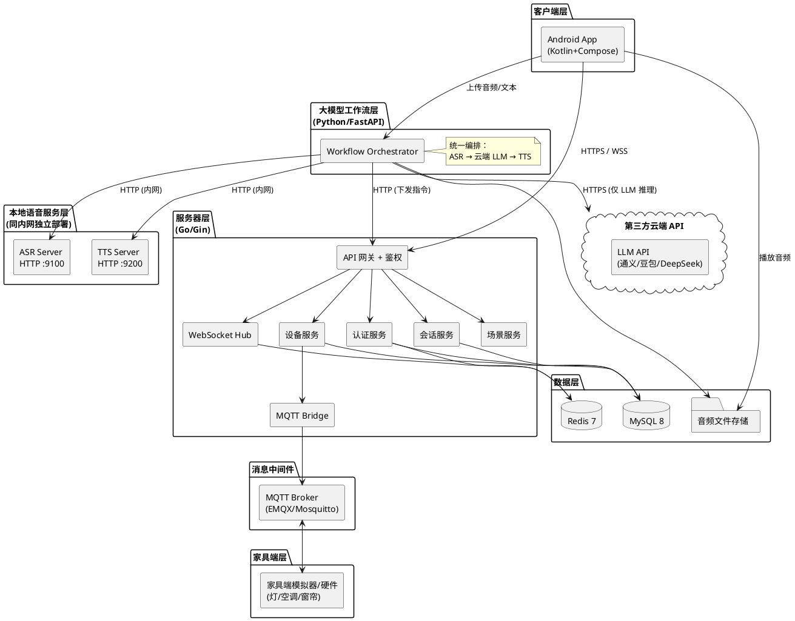
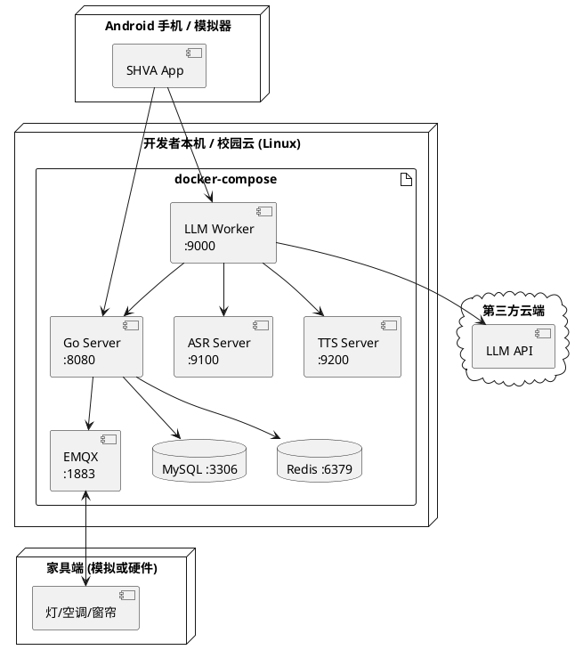
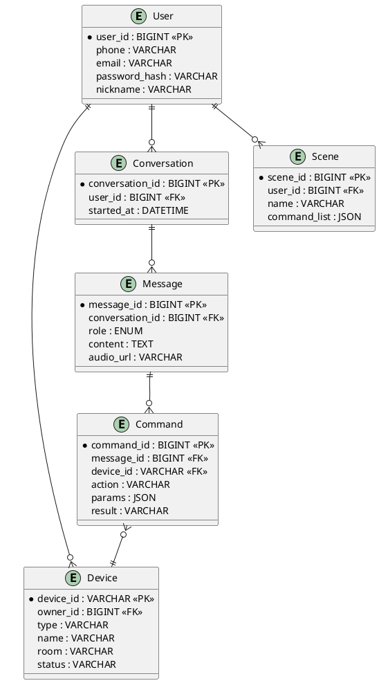
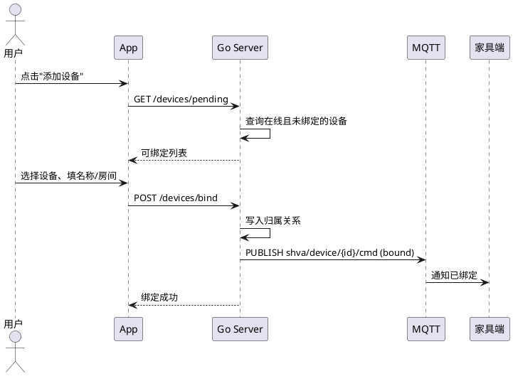
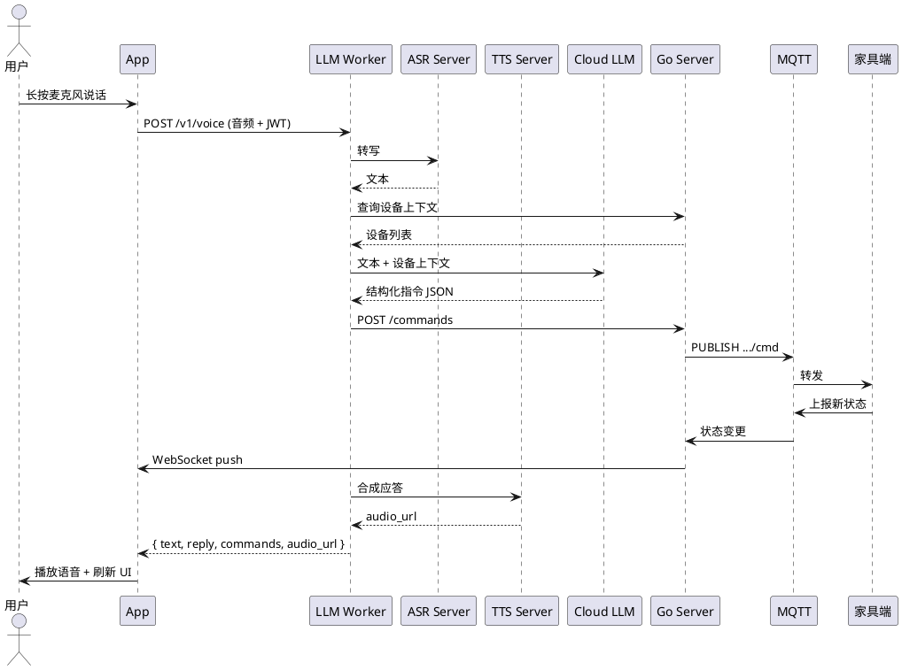
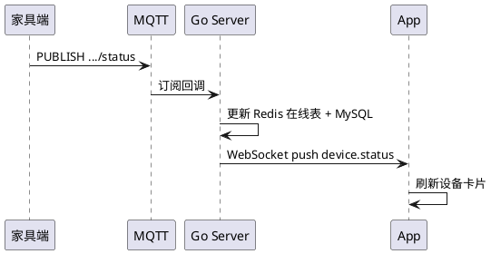

# 《智能家居语音交互助手系统》软件设计文档

| 项目名称 | 智能家居语音交互助手系统 |
|---|---|
| 项目代号 | SmartHome-Voice-Assistant（SHVA） |
| 文档版本 | v1.0 |
| 文档状态 | 草案（Draft） |
| 编写人 | 队长（统稿）；成员 A/B/C/D（分模块） |
| 编写日期 | 2026-05-18 ~ 2026-05-24 |
| 审核人 | 全体成员 |

---

## 修订历史

| 版本 | 日期 | 修订人 | 修订内容 |
|---|---|---|---|
| v1.0 | 2026-05-24 | 队长 | 初稿 |

---

## 1. 引言

### 1.1 编写目的

本文档描述"智能家居语音交互助手系统（SHVA）"的总体架构与关键设计决策，包括模块划分、接口约定、数据组织、关键流程等，作为后续编码实现与测试的依据。**本文聚焦"做什么、怎么分、怎么接"，不涉及具体实现代码与目录结构，相关细节由各模块在开发阶段自行决定。**

### 1.2 设计原则

| 原则 | 说明 |
|---|---|
| 分层架构 | 表现层 / 业务逻辑层 / 数据层 清晰分离 |
| 高内聚低耦合 | 按业务领域划分模块，模块间仅通过接口通信 |
| 面向接口编程 | ASR、TTS、LLM、设备协议均以接口或 API 形式暴露，底层实现可替换 |
| 消息驱动 | 设备侧采用 MQTT 发布/订阅，避免强耦合 |
| 面向演示 | 关键链路优先保证稳定与可视化，避免过度设计 |

---

## 2. 总体架构

### 2.1 系统总体架构图



### 2.2 分层结构

| 层 | 职责 | 实现 |
|---|---|---|
| 表现层 | 用户交互、录音/播放、状态展示 | Android App |
| 业务逻辑层 | 认证、设备管理、对话管理、场景编排 | Go 服务器 |
| 智能中枢层 | 语音 → 文本 → 意图 → 指令 → 语音 编排 | Python 工作流 + 本地 ASR/TTS + 云端 LLM |
| 数据层 | 持久化与缓存 | MySQL / Redis / 文件存储 |
| 消息层 | 设备接入与指令分发 | MQTT Broker |
| 家具端 | 指令执行与状态上报 | 硬件或模拟器 |

### 2.3 模块划分

| 模块 | 所属端 | 核心职责 | 负责人 |
|---|---|---|---|
| M-CL Android 客户端 | 客户端 | UI、录音、网络通信、状态展示 | 成员 B |
| M-GW API 网关 | 服务器 | 路由、鉴权、限流、日志 | 成员 A |
| M-AU 认证服务 | 服务器 | 注册、登录、JWT 签发/校验 | 队长 + 成员 A |
| M-DV 设备服务 | 服务器 | 设备绑定、状态缓存、MQTT 收发 | 成员 A |
| M-CH 会话服务 | 服务器 | 会话/消息持久化、WebSocket 推送 | 成员 A |
| M-SC 场景服务 | 服务器 | 场景定义与触发 | 成员 A |
| M-LM 大模型工作流 | 工作流 | 编排 ASR/LLM/TTS，产出结构化指令 | 成员 C |
| M-AS 本地 ASR 服务 | 工作流 | 对外提供语音识别 HTTP API | 成员 C |
| M-TS 本地 TTS 服务 | 工作流 | 对外提供语音合成 HTTP API | 成员 C |
| M-DE 家具端 | 家具端 | 设备驱动/模拟、MQTT 通信 | 成员 D |

### 2.4 部署视图



---

## 3. 关键模块设计

> 本节只描述每个模块的**职责、核心类/组件、对外契约**，具体实现（文件目录、代码细节、算法）由开发阶段根据约定自由落地。

### 3.1 Go 服务器（M-GW / M-AU / M-DV / M-CH / M-SC）

**职责**：对客户端提供 REST + WebSocket 接口；对家具端通过 MQTT 双向通信；对大模型工作流提供指令接收入口。

**核心组件**：

| 组件 | 职责 |
|---|---|
| API Gateway | 路由分发、JWT 鉴权、限流、统一错误包装 |
| 认证服务 | 密码哈希校验、Token 签发/刷新 |
| 设备服务 | 绑定/解绑、归属校验、通过 MQTT 下发指令、接收设备状态 |
| 会话服务 | 消息持久化、WebSocket 推送（状态变更 / 新消息） |
| 场景服务 | 组合多条指令、触发场景 |

**服务间依赖**：所有业务服务均依赖认证服务做鉴权；设备服务独占 MQTT Bridge；会话服务独占 WebSocket Hub。

### 3.2 Android 客户端（M-CL）

**职责**：作为用户交互入口，承担录音、播放、网络请求、状态展示。

**主要界面与交互**：

| 页面 | 关键元素 |
|---|---|
| 登录 / 注册 | 手机号/邮箱 + 密码 |
| 主页（设备） | 设备卡片列表；在线状态；麦克风入口 |
| 设备详情 | 开关、亮度/温度/位置 等控件 |
| 绑定设备 | 可绑定设备列表、命名、选房间 |
| 对话页 | 消息气泡、语音波形、按住说话 |
| 场景页 | 场景卡片、一键触发 |
| 个人中心 | 资料、改密码、登出 |

**技术选型**：Kotlin + Jetpack Compose（Material 3）；Retrofit + OkHttp（含 WebSocket）；MediaRecorder + ExoPlayer；MVVM 架构。

### 3.3 大模型工作流（M-LM / M-AS / M-TS）

**职责**：把用户自然语言转换为对家居设备的结构化控制指令，并产出应答语音。

**分工**（三者均以 HTTP 对外）：

| 子模块 | 部署 | 职责 |
|---|---|---|
| M-LM 工作流编排 | 本地 | 接收客户端语音/文本 → 依次调用 ASR、LLM、TTS → 向 Go 服务器下发指令 |
| M-AS 本地 ASR 服务 | 本地（独立进程/容器） | 输入音频，输出转写文本 |
| M-TS 本地 TTS 服务 | 本地（独立进程/容器） | 输入文本，输出音频（URL 或流） |
| 云端 LLM API | 云端 | 接收文本+设备上下文，输出结构化 JSON 指令 |

**关键契约（JSON Schema）**：LLM 的输出必须严格遵守如下结构：

```json
{
  "intent": "control_device | query_status | trigger_scene | chit_chat | unknown",
  "reply": "自然语言应答",
  "commands": [
    { "device_id": "xxx", "action": "turn_on", "params": { } }
  ]
}
```

**支持的设备动作**：

| 设备类型 | 动作 | 参数 |
|---|---|---|
| LIGHT | `turn_on / turn_off / set_brightness` | `brightness: 0~100` |
| AIRCON | `turn_on / turn_off / set_temp / set_mode` | `temp: 16~30`、`mode: cool/heat/auto` |
| CURTAIN | `open / close / set_position` | `position: 0~100` |
| SOCKET | `turn_on / turn_off` | — |

**降级策略**：云端 LLM 不可用时切备用 Provider；ASR 服务不可达时前端退化为"仅文本输入"；TTS 不可达时返回纯文本不播音。

### 3.4 家具端（M-DE）

**职责**：接入服务器、接收控制指令、上报状态与心跳。

**实现策略**：**软件模拟器优先、硬件为辅**——两者遵循同一 MQTT 协议（见 4.4）。默认演示使用软件模拟器保证稳定性；若硬件（ESP32/树莓派）调通，可现场加分。

---

## 4. 接口设计

### 4.1 接口全景

| 通道 | 协议 | 调用方 → 被调方 | 用途 |
|---|---|---|---|
| 客户端 API | HTTPS / JSON | Android App → Go 服务器 | 登录、设备管理、会话等 |
| 实时推送 | WSS | Go 服务器 → Android App | 设备状态、新消息推送 |
| 工作流入口 | HTTPS / multipart | Android App → Python 工作流 | 上传音频或文本 |
| 指令回传 | HTTPS / JSON | Python 工作流 → Go 服务器 | 提交结构化指令 |
| ASR 服务 | HTTP / multipart | Python 工作流 → ASR Server | 语音转写 |
| TTS 服务 | HTTP / JSON | Python 工作流 → TTS Server | 语音合成 |
| LLM 调用 | HTTPS / JSON | Python 工作流 → 云端 LLM | 意图识别 |
| 设备通信 | MQTT v3.1.1 | Go 服务器 ↔ 家具端 | 指令下发、状态上报 |

### 4.2 客户端 REST API（Go 服务器）

Base URL：`https://<host>/api/v1`；除登录注册外均需 `Authorization: Bearer <jwt>`。统一响应包装：`{ code, msg, data }`。

**主要接口分组**：

| 模块 | 端点 | 对应用例 |
|---|---|---|
| 认证 | `POST /auth/register`、`POST /auth/login`、`POST /auth/logout` | UC-01、UC-02 |
| 用户 | `GET / PATCH /users/me`、`POST /users/me/password`、`DELETE /users/me` | UC-12、UC-13 |
| 设备 | `GET /devices`、`GET /devices/pending`、`POST /devices/bind`、`POST /devices/{id}/unbind`、`GET /devices/{id}/status` | UC-03、UC-04、UC-11 |
| 指令 | `POST /commands`（由工作流调用） | UC-05、UC-06 |
| 会话 | `GET /conversations`、`GET /conversations/{id}/messages` | UC-08 |
| 场景 | `GET /scenes`、`POST /scenes`、`POST /scenes/{id}/trigger` | UC-09 |

完整参数与示例在开发阶段由成员 A 维护于 `docs/attachments/openapi.yaml`。

### 4.3 WebSocket 事件

- 连接地址：`wss://<host>/ws?token=<jwt>`
- 客户端每 30s `ping`；服务端 `pong`

| `type` | Payload（关键字段） | 触发时机 |
|---|---|---|
| `device.status` | `device_id, status, detail` | 家具端状态变更 |
| `device.online` / `device.offline` | `device_id` | 设备上/下线 |
| `chat.message` | `message_id, role, content, audio_url` | 新消息入库（跨端同步） |

### 4.4 MQTT Topic 规范

| Topic | 方向 | 说明 | QoS |
|---|---|---|---|
| `shva/device/{id}/register` | Dev→Server | 上线注册 | 1 |
| `shva/device/{id}/cmd` | Server→Dev | 下发控制指令 | 1 |
| `shva/device/{id}/status` | Dev→Server | 状态上报 | 1 |
| `shva/device/{id}/result` | Dev→Server | 指令执行结果 | 1 |
| `shva/device/{id}/heartbeat` | Dev→Server | 心跳（30s） | 0 |

### 4.5 大模型工作流对外接口

| 接口 | 输入 | 输出 |
|---|---|---|
| `POST /v1/voice` | 音频文件 + JWT | `{ text, reply, commands, audio_url }` |
| `POST /v1/text` | 文本 + JWT | `{ reply, commands, audio_url }` |
| `GET /v1/health` | — | `{ asr, tts, llm }` 健康状态 |

### 4.6 本地 ASR / TTS 服务接口

| 接口 | 输入 | 输出 |
|---|---|---|
| `POST /v1/asr/transcribe` | 音频文件 | `{ text, duration_ms }` |
| `POST /v1/tts/synthesize` | `{ text, voice, format }` | 音频字节流，或 `{ audio_url }` |

### 4.7 错误码约定（节选）

| code | 说明 |
|---|---|
| 0 | 成功 |
| 4001 | 参数错误 |
| 4010 / 4011 | 未登录 / Token 过期 |
| 4030 | 无权限（设备不属于当前用户） |
| 4040 | 资源不存在 |
| 4090 | 设备已被绑定 |
| 4291 | 请求过于频繁 |
| 5000 | 服务器内部错误 |
| 5001 | 大模型服务不可用 |
| 5002 | 设备离线 |

---

## 5. 数据库设计

### 5.1 ER 图



### 5.2 表与缓存职责

| 存储 | 数据 | 说明 |
|---|---|---|
| MySQL `user` | 用户基本信息 | 密码 bcrypt 存储 |
| MySQL `device` | 设备归属与元信息 | `owner_id` 建索引 |
| MySQL `conversation / message` | 会话与消息记录 | 按会话+时间复合索引 |
| MySQL `command` | 指令执行记录 | 便于审计与回放 |
| MySQL `scene` | 场景定义 | `command_list` 以 JSON 存储 |
| Redis | Token、在线用户集、设备在线心跳、接口限流 | 具体 Key 设计在开发时由成员 A 维护 |

> 完整字段、类型、索引、默认值在开发阶段由成员 A 以 Migration SQL 脚本落地（`migrations/` 目录），本文不再列出详细 DDL。

---

## 6. 关键流程设计

> 选取 3 条最能体现系统协作的核心链路作为代表，其余流程（注册、解绑、历史查询等）在实现时按同一思路拆分。

### 6.1 设备绑定（UC-03）



### 6.2 语音指令全链路（UC-06，系统核心链路）



### 6.3 设备状态实时推送（UC-10）



---

## 7. 界面设计

### 7.1 设计规范

- 设计系统：Material 3
- 主色 `#4A90E2`（智慧蓝）；辅色 `#27AE60`（成功）、`#E74C3C`（警告）
- 卡片圆角 16 dp、按钮圆角 12 dp；支持暗色模式

### 7.2 页面清单

见 3.2 节。详细线框图与交互稿由成员 E 使用 Figma 维护，最终导出 PNG 放入 `docs/images/ui/`。

---

## 8. 安全与非功能需求落地

| NFR | 落地方案 |
|---|---|
| NFR-P1 语音 ≤3s | 本地 ASR/TTS 与工作流同内网，HTTP keep-alive；Prompt 长度限制；TTS 异步 |
| NFR-P5 状态推送 ≤1s | MQTT + WebSocket 内存路由，不落库 |
| NFR-R2 自动拉起 | `systemd` 或 Docker `restart: always` |
| NFR-R3 消息不丢 | MQTT QoS 1 + 数据库事务 |
| NFR-S1 传输与隐私 | HTTPS / WSS；原始音频仅在本地内网流转，仅文本进入云端 LLM |
| NFR-S2 认证 | JWT（HS256，2h 过期）+ Refresh Token |
| NFR-S4 密码存储 | bcrypt 加盐哈希 |
| NFR-E1 可替换 | LLM Provider 与 ASR/TTS 服务均以接口/HTTP 形式暴露，可热切换 |

---

## 9. 技术选型决策记录（ADR）

| 编号 | 主题 | 决策 | 理由 |
|---|---|---|---|
| ADR-01 | 服务器语言 | Go | 队内掌握、并发性能好、单二进制部署 |
| ADR-02 | 客户端平台 | Android | 主流、工具链成熟、成员 B 熟悉 |
| ADR-03 | 语音与 LLM 部署 | ASR/TTS 本地独立 HTTP 服务，LLM 云端 API | 本地 ASR/TTS 延迟低、隐私可控；云端 LLM 能力强、无需本地算力 |
| ADR-04 | 设备协议 | MQTT | IoT 事实标准、天然发布订阅 |
| ADR-05 | 家具端实现 | 软件模拟器优先 | 硬件风险高，先保证可演示 |
| ADR-06 | 文档协作 | Markdown → Pandoc 导出 Word | 便于多人并行编写、Git 管理 |

---

## 10. 遗留问题与后续计划

| 编号 | 问题 | 处理计划 |
|---|---|---|
| OPEN-01 | 家具端具体硬件尚未确定（ESP32 / 树莓派 / 纯模拟） | 编码阶段第一周决策，先按 MQTT 协议推进模拟器 |
| OPEN-02 | 云端 LLM 具体选型（通义 / 豆包 / DeepSeek） | 成员 C 在本周内对 3 家做 Prompt 效果对比后决定 |
| OPEN-03 | 音频文件存储介质（本地 FS / 对象存储） | MVP 阶段先用本地 FS，演示前评估是否需要迁移 |
